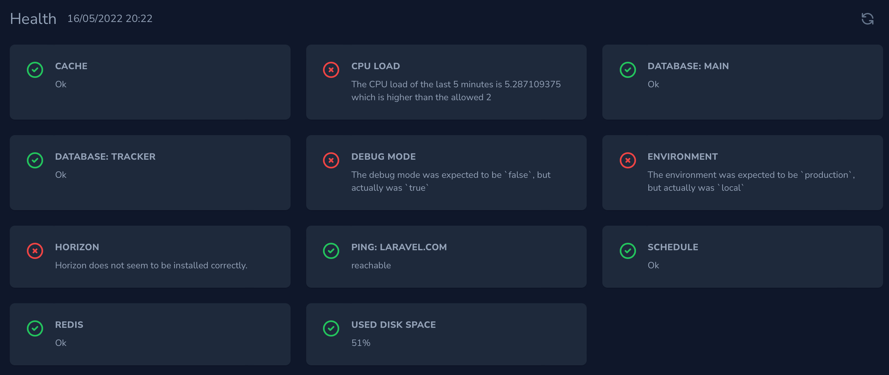
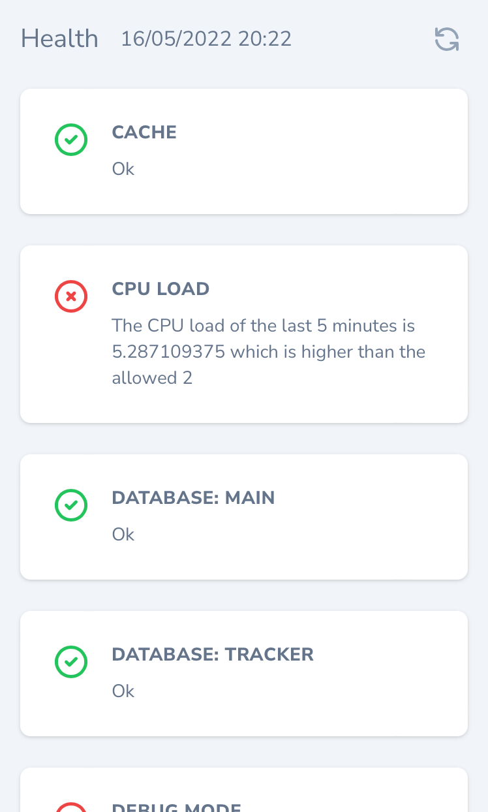

# Laravel Nova tool for checking healthy of your Laravel app

## Screenshots

## Credits

- [Artem Stepanenko](https://github.com/stepanenko3)

## Contributing

Thank you for considering contributing to this package! Please create a pull request with your contributions with detailed explanation of the changes you are proposing.

## License

This package is open-sourced software licensed under the [MIT license](LICENSE.md).
